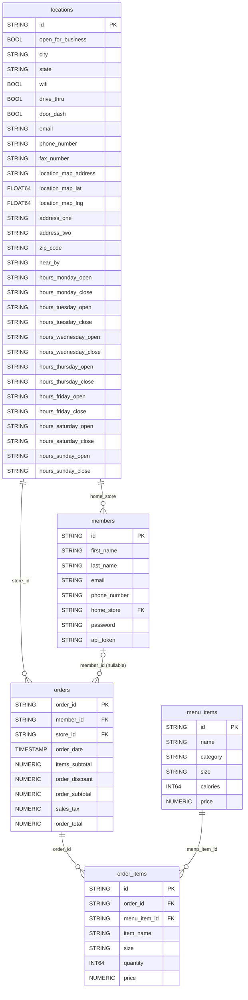

# Uncle Joe's Coffee Company Setup

This repository contains the data and sample code you will need to start the Uncle Joe's Coffee Company project.

There are three components:

- [GCP Setup](#adding-teammates-to-your-gcp-project)
- [Database Setup](#database-setup)
- [API Example](#api-example)

## Adding Teammates to Your GCP Project

Because you are working in a group, you should all share a single Google Cloud Project. See **[GCP.md](GCP.md)** for step-by-step instructions on adding teammates to your Google Cloud Project using IAM. All team members will be granted the Owner role so everyone has equal access to shared resources like BigQuery.

## Database Setup

Follow these steps in order. You need a Google Cloud project with BigQuery enabled before you start.

---

### Step 1 — Review the CSV files

Included here are five CSV files that represent the tables in your database:

| File | Description |
|------|-------------|
| `uncle_joes_locations.csv` | 485 store locations |
| `uncle_joes_menu.csv` | 30 menu items |
| `uncle_joes_coffee_club_members.csv` | Existing members |
| `uncle_joes_orders.csv` | 20+ years of order history |
| `uncle_joes_order_items.csv` | Line items for orders |

---

### Step 2 — Create the BigQuery dataset

1. Go to [console.cloud.google.com/bigquery](https://console.cloud.google.com/bigquery)
2. In the left panel, click the three dots next to your project name → **Create dataset**
3. Set **Dataset ID** to `uncle_joes`
4. Set **Data location** to `us-central1`
5. Click **Create dataset**

---

### Step 3 — Create the tables

1. In the BigQuery console, click **+ Compose a new query**
2. Open `create_tables.sql` from this folder and paste the entire contents into the query editor
3. At the top of the pasted SQL, replace `your-project` with your actual GCP project ID (visible in the top-left of the console, e.g., `mgmt545-yourname`)
4. Click **Run**

You should see five new tables appear under `uncle_joes` in the left panel:
`locations`, `menu_items`, `members`, `orders`, `order_items`

---

### Step 4 — Import the CSV files

Repeat these steps for each table/file pair:

| Table | CSV file |
|-------|----------|
| `locations` | `uncle_joes_locations.csv` |
| `menu_items` | `uncle_joes_menu.csv` |
| `members` | `uncle_joes_coffee_club_members.csv` |
| `orders` | `uncle_joes_orders.csv` |
| `order_items` | `uncle_joes_order_items.csv` |

**For each one:**

1. Click the table name in the left panel
2. Click **Import** (toolbar at the top right of the table view)
3. Under **Create table from**, choose **Upload**
4. Click **Browse** and select the matching CSV file
5. Set **File format** to `CSV`
6. Under **Schema**, choose **Auto-detect** — leave everything else as-is
7. Expand **Advanced options** → set **Header rows to skip** to `1`
8. Click **Create table**

> **Note:** BigQuery will overwrite the table's data if you import again. That's fine for regenerating fresh data.

---

### Step 5 — Verify the import

Run a quick check on each table:

```sql
SELECT COUNT(*) FROM `your-project.uncle_joes.locations`;
SELECT COUNT(*) FROM `your-project.uncle_joes.menu_items`;
SELECT COUNT(*) FROM `your-project.uncle_joes.members`;
SELECT COUNT(*) FROM `your-project.uncle_joes.orders`;
SELECT COUNT(*) FROM `your-project.uncle_joes.order_items`;
```

If all counts look right, your dataset is ready to use.

> [!IMPORTANT]
> **Shared password — All members use the password `Coffee123!`, stored as a bcrypt hash. This is intentional for classroom use so students can log in as any member.**

---

### Table Relationships



---

## API Example

The `api_example/` subdirectory contains a minimal [FastAPI](https://fastapi.tiangolo.com/) application that demonstrates how to wire up a login endpoint with a hashed password against the BigQuery dataset.

> [!IMPORTANT]
> **REMEMBER! Shared password — All members use the password `Coffee123!`, stored as a bcrypt hash.**

**What it shows:**

- Accepting `email` and `password` in a JSON POST body via a Pydantic model
- Encoding the submitted password and hashing it with `bcrypt` (illustrating that plain-text passwords are never passed further down the stack)
- Building a **parameterized** BigQuery query (no string interpolation) to fetch the member record by email
- Verifying the submitted password against the stored bcrypt hash with `bcrypt.checkpw()`

**To run it:**

- Ensure your database is established and populated 
- FORK this repository in GitHub
- Clone your forked repository to Google Cloud Shell
- From the command line, do the following:

```bash
cd api_example
poetry install
poetry run uvicorn main:app --reload
```

- Use the web preview function and visit the `/docs` path for the auto-generated Swagger UI
- Find the `/login` endpoint and "Try it out"
    - You can log in with any email address in the `members` table
    - Use the common `Coffee123!` password for **every** user

> [!NOTE]
> For this to work in Cloud Shell, you must set your Google Cloud project on the command line: `gcloud config set project <project_id>` 
> 
> You must also set `GCP_PROJECT` in `main.py` to your actual project ID before running
